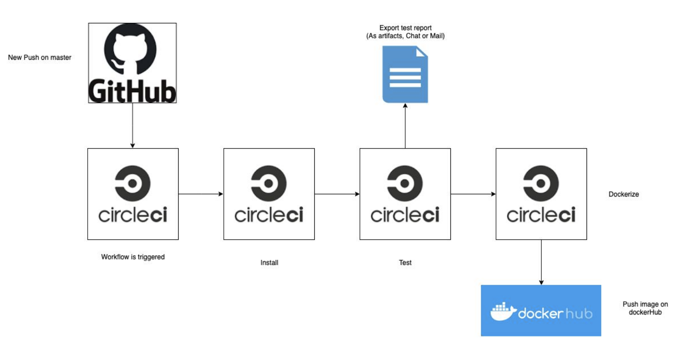
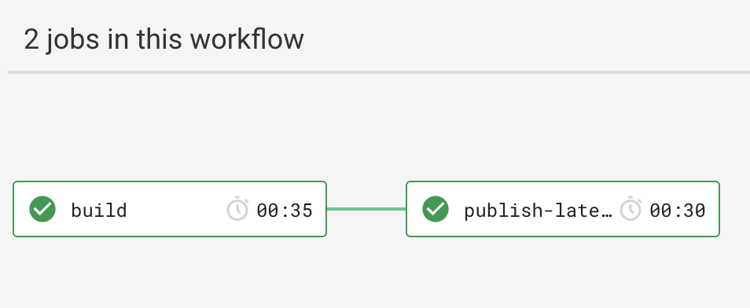
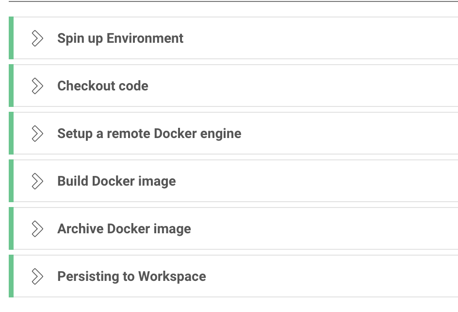
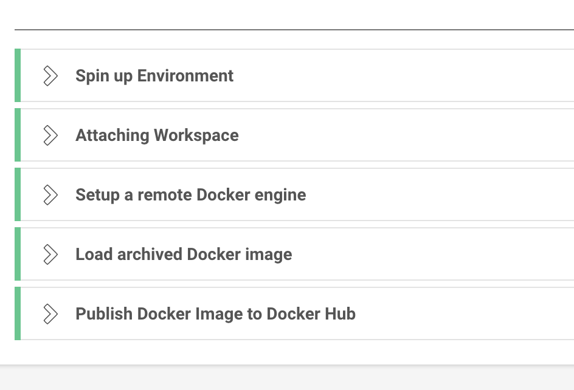

<p align="center">
  <a href="https://example.com/">
    
  </a>

  <h3 align="center">Ynov - B3 Info - GUMBAU Elric | MEAU Alix</h3>
</p>

## B3 Devops - TP 2

- [What is CircleCI ?](#What-is-CircleCI)
- [CircleCI in this project](#CircleCI-in-this-project)
- [Configuration](#Configuration)
- [Pipeline](#Pipeline)
- [Workflow](#Workflow)
- [Find our image](#Find-our-image)
- [Docs](#Docs)


## What is CircleCI

> CircleCI allows teams to rapidly build quality projects, at scale. Our mission is to give people everywhere the power to build and deliver software at the speed of imagination.

More info in `docs section` 👍


## CircleCI in this project

In this project, we are using CircleCI to create an automated pipeline to create a Docker image of our NodeJS API. Used in this [repo](https://github.com/YI-B3-Devops/tp2-gumbau-elric).


## Configuration

Everything goes in the .circleci folder.

```text
tp2-team-4/
└── .circleci/
    ├── api/
    │   ├── Dockerfile
    │   └── package.json
    ├── config.yml

```
config.yml contains all the instructions for setting up the pipeleine, creating the image, build the container api then pushing on the docker hub.

More infos about config.yml in `docs section` 👍.

### On CircleCI
- First, connect to circleCI
- Follow the repo in the add project section of the site CircleCI
- Then build the project
- CircleCI is ready and wait for us to push on the repo we just followed

### On GitHub
- Push on the master branch of the repo
- CircleCI automatically detects push and recreate the docker image on dockerHub

## Pipeline

- CircleCI detects the push and the workflow is triggered.
- The container is then installed via the Dockerfile pass in parameters in the instructions of the file config.yml (ligne 17).
- Then CircleCI test and dockerize our container.
- Finally, it is push on the docker hub, credentials are passed in parameter to connect to the account.

### Shema
<p align="center">
  
</p>

## Workflow


> Sequential job execution: Run build, test, and deploy sequentially as individual jobs and get faster feedback from each job. CircleCI 1.0 runs your build-test-deploy jobs in sequential lock-step.

More infos about Workflow in `docs section` 👍.

Here is the workflow present on our circleci, 2 jobs are present, a build part and a dockerize part, you will find the details on the images below.

### Workflow

<p align="center">
  
</p>

### Build part

<p align="center">
  
</p>

### Dockerize part

<p align="center">
  
</p>

## Find our image

<p align="center">
Our image which contains our node.js api is present on the docker hub at this address :
  https://hub.docker.com/r/elricgumbau/team4-api
</p>
<p align="center">🐳</p>

## Docs

Docker              : https://docs.docker.com/

Dockerfile          : https://docs.docker.com/engine/reference/builder/

CircleCI            : https://circleci.com

config.yml          : https://circleci.com/docs/2.0/configuration-reference/

Workflow            : https://circleci.com/blog/introducing-workflows-on-circleci-2-0/


Enjoy ! 😉
